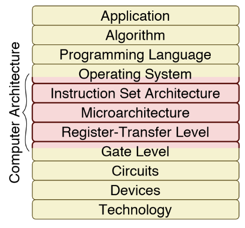

# Computer Architecture and the Computing Stack

You've likely developed programs such as the following:

```
void daxpy(int n, double a, double *x, double *y){
    for (int i = 0 ; i < n; ++i){
        y[i] = a * x[i] + y[i];
    }
}
```

But, how does the program actually get executed on the hardware level?





# Why Should I Care About Computer Hardware?

Though the majority of software engineers may not need to know in-depth about 

This topic will interest you if you are interested in:
1. Microprocessor Design
1. Computer Security
1. Compilers/Operating Systems
1. Embedded Systems
1. Library Development
1. Optimized and Efficient Programming


